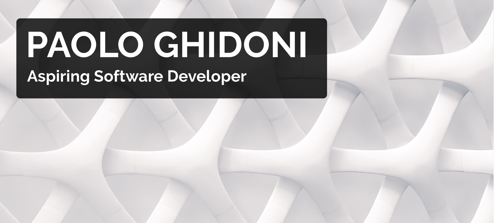

# Hello World, I am Paolo!

I am an aspiring Software Developer who enjoys *each and every new challenge*. 

## My experience with coding so far includes:

 * Building 3 startup landing pages.
 * Joining @fac-23 September 2021 cohort of the [Founders and Coders](https://www.foundersandcoders.com) coding bootcamp in London.

## My favorite technologies to work with are:
|||||
-------|--------|--------|--------|--------|--------

## My core goals are:

* Learning something new every day; my goal for 2021 - 2022 is to learn React.js and Node.js.
* Working on meaningful projects. 
* Cooperating with passionate and committed people.
* Building products that users can benefit from.
* Constantly grow and improve as a human being and as a developer.

## You can also find me here:

[  Codewars](https://www.codewars.com/users/PaoloGhidoni)

[  Free Code Camp](https://www.freecodecamp.org/paolo)

## My other interests are:

* Audio Engineering 🎤 & music - listening 🎶 and playing 🎸

* Pooches 🐶 🐶 🐶

* Food. 🍝 I will eat anything once. I will eat pizza twice as much 🍕

* UFOs. For real. 👽 🛸

