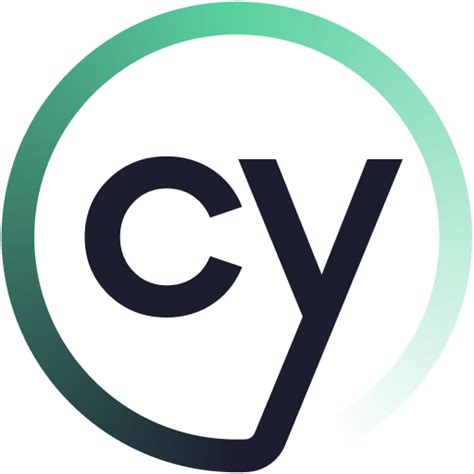
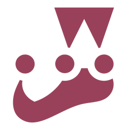
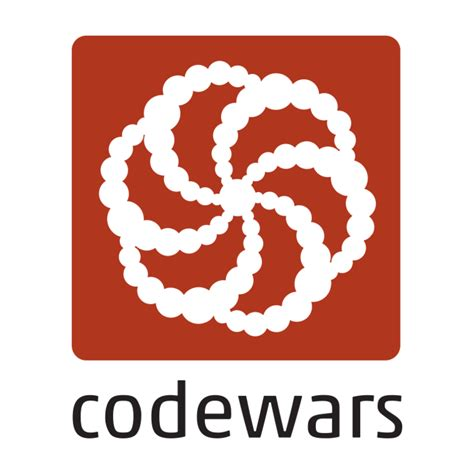

# Hey! I am Paolo!

I am a Software Developer who enjoys _each and every new challenge_.

## Technologies I Use

  
  
  
  
  
  
  
  
  
  
  
  
  
  

## My core goals are:

- Working on meaningful projects that have a social impact and meet the user's need.
- Learning technology with a dynamic, sustainable approach.
- Cooperating with passionate and committed people.
- Constantly grow and improve as a human being and as a developer.

## Connect With Me

  
  
  
  

## My other interests are:

- Audio engineering & music.
- Pooches.
- Food: I will eat anything once. I will eat pizza twice as much.
