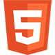
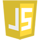
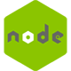
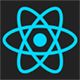

# Hello World, I am Paolo!

I am a Software Developer who enjoys _each and every new challenge_.

## My favorite technologies to work with are:

|  |  |  |  |  |  |  |
| -------------------------- | ------------------------ | ------------------------------ | ---------------------------------- | ------------------------------------ | -------------------------------- | ------------------------ |

## My core goals are:

- Learning something new every day.
- Working on meaningful projects that users can benefit from.
- Cooperating with passionate and committed people.
- Constantly grow and improve as a human being and as a developer.

## You can also find me here:

[ Codewars](https://www.codewars.com/users/PaoloGhidoni)

[ Free Code Camp](https://www.freecodecamp.org/paolo)

## My other interests are:

- Audio engineering & music.

- Pooches.

- Food. I will eat anything once. I will eat pizza twice as much.
