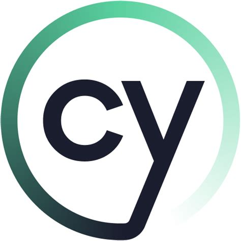
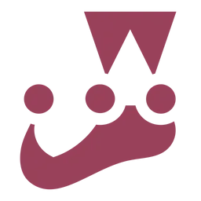
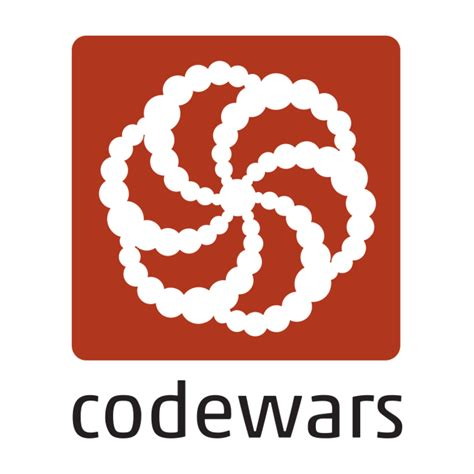

# Hey! I am Paolo!

I am a Software Developer with a passion for building intuitive, user-focused applications that make a tangible difference in people’s lives.
I combine technical expertise with a commitment to meaningful innovation.

## Technologies I Use

| JS | TS | React | Angular | Next |
| --- | --- | --- | --- | --- |
|  |  |  |  |  |

| Node | Tailwind | AWS | Cypress | Jest |
| --- | --- | --- | --- | --- |
|  |  |  |  |  |

| Figma | Git | Sass | Styled | Python |
| --- | --- | --- | --- | --- |
|  |  |  |  |  |

| OpenAI | LangChain |  |  |  |
| --- | --- | --- | --- | --- |
|  |  |  |  |  |

## Connect With Me

| LinkedIn | LeetCode | Codewars | FCC |
| --- | --- | --- | --- |
|  |  |  |  |

## My other interests are:

- Audio engineering & music.
- Pooches.
- Food: I will eat anything once. I will eat pizza twice as much.
